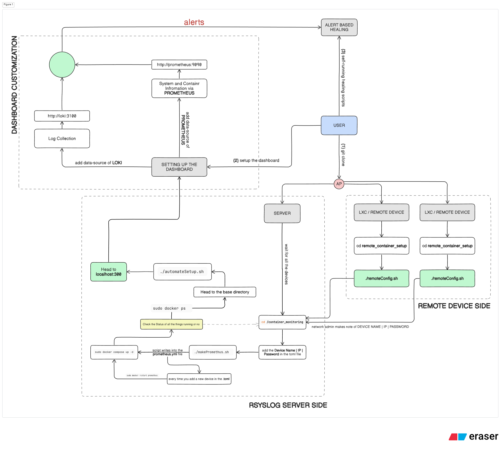

# Network Analyzer & Healer  
- **Centralized log aggregation** :- Rsyslog → Promtail → Loki
    
- **Host and container metrics** :- Node Exporter & cAdvisor → Prometheus

- **Unified dashboards** :- Grafana for visualizing logs and metrics together

- **Automated healing**
  - Shell scripts triggered based on alert conditions
  - Execution over SSH to remote systems
  - Helps auto-correct failures such as high CPU usage, service crashes, insufficient memory, and more

---

## Architecture Overview


## Remote Device
- Backed by rsyslog, node-exporter, and cAdvisor
- Collects system logs and performance data
- Sends everything to the monitoring server

## Central Monitoring Server
- Promtail receives logs and writes them to Loki
- Prometheus scrapes performance and container metrics
- Grafana visualizes all collected data
- Alert triggers can remotely execute healing scripts to fix system issues on the remote machines

This forms a complete end-to-end automated loop:

1. **Monitor**
2. **Detect**
3. **Alert**
4. **Auto-Heal**

All executed entirely on-premise, without internet or cloud services.

---

## Repository Structure
<!--REPO_TREE_START-->
```
.
├── LICENSE
├── README.md
├── automateSetup.sh
├── config
│   ├── loki-config.yaml
│   ├── promtail-config.yaml
│   └── rsyslog.conf
├── container-monitoring
│   ├── README.md
│   ├── deviceDetails.toml
│   ├── docker-compose.yml
│   ├── makePrometheus.sh
│   ├── prometheus.yml
│   ├── prometheus_template.yml
│   └── queries.promql
├── dashboard.json
├── docker
│   └── docker-compose.yml
├── images
│   ├── image.png
│   └── setup_flow.png
├── remote_container_setup
│   ├── README.md
│   ├── remoteConfig.sh
│   └── remoteShutdown.sh
├── restart.sh
└── scripts
    ├── ubuntu-rsyslog-setup.sh
    └── validate-install.sh
```
<!--REPO_TREE_END-->

---
## PRE-REQUIREMENTS (to have for proper and smooth flow)
- Proper Internet and Network Connectivity *(the remote devices should be such that in the network that they are reachable by the rsyslog server)*
- Pre-Installed Git on the LXCs *(there is no provision of downloading `git` as the project itself comes via git-thus, have git pre-installed in the device without which, repo can't be pulled)*
- Basic Linux *(Ubuntu)* packages downloaded like `net-tools`. Also, `systemd` enabled *(required for services on most setups)*
- Sufficient free disk space, especially for the Rsyslog Server - the one that will even have the Dashboard.
- **[OPTIONAL]** Proper permissions on log directories *(as the script will look after the permissions and other things)*
- Proper hostname and DNS resolution in the network 


---

## Overall System Requirements

### Component Resource Usage Overview
| Component | RAM Usage | Disk Usage | Notes |
|---|---|---|---|
| Docker | Low | 2–3 GB for base + images | Lightweight base runtime |
| Prometheus | 2–8 GB | 50+ GB | Metrics storage grows with time series |
| Grafana | 200–500 MB | Very low | Mostly dashboard metadata |
| Loki | Similar to Prometheus | Depends heavily on log size | High log environments need more disk |
| Promtail | 100–300 MB | Minimal | Agent for collecting logs |
| cAdvisor | <100 MB | Minimal | Lightweight container metrics collector |

</br>

### Hardware Requirements
| Category | Minimum (Basic Testing) | Recommended (Real Monitoring) |
|---|---|---|
| CPU | 2 cores | 4–8 cores |
| RAM | 4 GB | 8–16 GB |
| Disk | 50 GB (SSD recommended) | 150–500 GB+ SSD |
| OS | Linux (preferably Ubuntu) | Linux (Ubuntu or similar) |
| Network | Basic connectivity | Connection across all the LXCs / Devices to Monitor |
| Suitable For | Light, small-scale monitoring | Multiple devices, faster queries, higher log volume |


--- 

## Setup Instructions

Run the following commands on **Ubuntu**:

```bash
# Clone the repository
git clone <repo-url>
cd Network-Analyzer-and-Healer

# FOR CLIENT SIDE (REMOTE DEVICES)
./remoteConfig.sh

# FOR SERVER SIDE (CENTRAL MONITORING SYSTEM)
./automateSetup.sh

# in case some problem happens, and exits without proper setup, run this, and then resolve
./restart.sh

cd container-monitoring

# Update your monitoring list:
# Edit deviceDetails.toml and add:
# IP = ""
# NAME = ""
# PASS = ""
./makePrometheus.sh

# once prometheus is done, first, start the ./automateSetup.sh
cd ..
./automateSetup.sh

# this will download the Docker and the Log Monitoring Stack.
# once that is done, we head to the Node Monitoring and its Container Monitoring

# Start monitoring stack
cd container-monitoring
sudo docker compose up -d

# Validate Prometheus scraping targets
# Navigate to http://prometheus:9090 and check under "Targets"
# Remote systems should be visible as healthy

# Then open Grafana (http://localhost:3000)
# and add data sources for both Loki and Prometheus

# Open Dashboards > Import > Paste the dashboard.json there.
# Once that is done, make different dashboards for different devices, and monitor them, and customize. 
```

The script will:
- Install Docker & Docker Compose (if missing)
- Configure Rsyslog to forward logs
- Start Promtail, Loki, and Grafana containers
- Start Prometheus and cAdvisor if, system's container monitoring needed along with Remote device's
- Provide a custom template for Grafana *(`dashboard.json` in the repo is for the same)*

---


## Expected Result
- Rsyslog service active and forwarding logs
- Promtail and Loki running (docker ps)
- Prometheus scraping remote node-exporter and cAdvisor targets
- Grafana accessible at: `http://localhost:3000`

## Default Grafana credentials
- `Username`: admin
- `Password`: admin

## Viewing Logs
- Open Grafana: `http://localhost:3000`
- Add Loki as a Data Source:
    - URL: `http://loki:3100`
- Add Prometheus as a Data Source:
    - URL: `http://prometheus:9090`


---

## Version History
| Version | Date | Description | Status |
|---------|------|-------------|--------|
| v1.0.0  | 1st November, 2025  | Automated Setup of the whole Project, with Log aggregation | `COMPLETED` |
| v1.0.1  | 23rd November, 2025 | Adding Basic Log interpretation, and base recovery queries | `COMPLETED` |
| v2.0.0  | TBA  | Fulling running Repository | `TO-DO` |

---

## Troubleshooting
> will be added here soon
---

## License

Licensed under the MIT License — feel free to modify and extend.

---

> *Part of the “Network Healer” suite — building self-healing, intelligent monitoring systems.*
